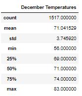

# surfs_up
## Overview
In this project we will be looking into wheather data from Oahu city in Hawaii, with the intention to determine if a surf and ice cream shop bussines is a sustainable bussines year-round. More specifically, we will focus on temperature trends and on the months of June and December.
Ideally, temperatures should be not too cold to keep customers comming, but not too hot to keep them from going out.
## Results
Two tables were created one for the month of June and one for December.

  
*June table*  
  
  
*December table*

- June has an average temperature of 74.94 degrees with a minimum and maximum of 64 and 85 respectively.
- December has an average temperature of 71.04 degrees with a minimum and maximum of 56 and 83 respectively.
- June has a very symetrical distribution, which suggest temperatures are expected to change evenly throughout the month.
- December has also a symetrical distribution but sliltly skewed to the right, we can expect about half of the month to see temperatures of 71 and higher.

## Summary
From the analisys we can conclude that Oahu has a farly warm wheather throuhgout the year without getting too hot. Analysis also suggest that we can expect temperatures to not change drastically from day to day since the standard diviation for June is 3.25 and for Decembers is 3.74.
Eventhough our focus was only on temperatures, we could have done a deeper dive into the database to learn more. For insteance, I would run a query to find out more about rain and determine patterns. Depending on the data available I would also run queries to know more about atmospheric pressure and try find out if this is hurricane prone area.